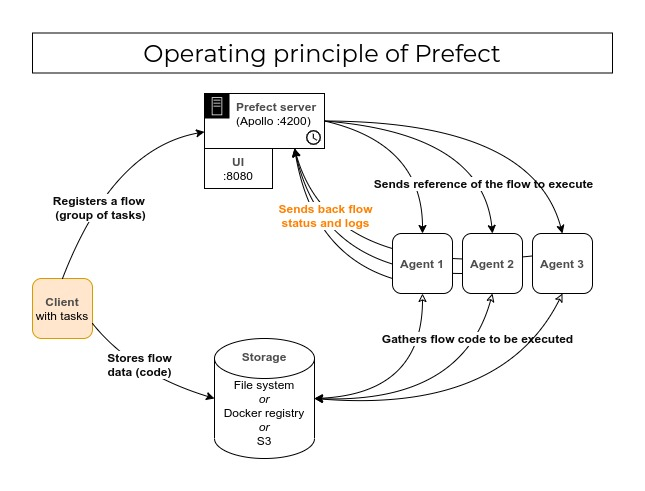

# Prefect - Docker Compose

A simple guide to understand and make Prefect work with your own docker-compose configuration.

This allows you to package your Prefect instance for Kubernetes or offline use.



- [Prefect - Docker Compose](#prefect---docker-compose)
  - [Run the server](#run-the-server)
  - [Run one or multiple agents](#run-one-or-multiple-agents)
  - [Run your first flow via the Prefect API](#run-your-first-flow-via-the-prefect-api)
    - [Principles to understand](#principles-to-understand)
    - [Flow on Local storage (recommended for a single machine)](#flow-on-local-storage-recommended-for-a-single-machine)
    - [Flow on S3 (recommended for distributed computing)](#flow-on-s3-recommended-for-distributed-computing)
    - [Flow on Docker storage](#flow-on-docker-storage)

## Run the server

Open and edit the [`server/.env`](./server/.env) file.  
All `PREFECT_SERVER_*` options are [explained in the official documentation](https://docs.prefect.io/core/concepts/configuration.html#environment-variables) and [listed in the `config.toml` file](https://github.com/PrefectHQ/prefect/blob/master/src/prefect/config.toml).

Then you can run :

```bash
docker-compose -f server/docker-compose.yml up -d
```

Then we need to create a _tenant_. Execute on your host :

```bash
pip3 install prefect
prefect server create-tenant --name default --slug default
```

Access the UI at _localhost:8080_

## Run one or multiple agents

Agents are services that run your scheduled flows.

Open and edit the [`agent/config.toml`](./agent/config.toml) file. Then you can run :

You can run the agent on another machine than the one with the Prefect server. Edit the [`agent/.env`](./agent/.env) file for that.

```bash
docker-compose -f agent/docker-compose.yml up -d
```

Maybe you want to instanciate multiple agents automatically ?

```bash
docker-compose -f agent/docker-compose.yml up -d --scale agent=3 agent
```

## Run your first flow via the Prefect API

### Principles to understand

> [Execution in your cloud; orchestration in ours](https://medium.com/the-prefect-blog/the-prefect-hybrid-model-1b70c7fd296)

This means the Prefect server never stores your code. It just orchestrates the running (optionally the scheduling) of it.

1. When coding a flow, you need first to [**register it** to the Prefect server](./client/weather.py#L44). You can there say to the server that you want your flow to be run 3 times a day for example.
2. You code never lies on the Prefect server : this means it has to store the code to be executed on an agent, somewhere the agent can access it.

    Prefect has [a lot of storage options](https://docs.prefect.io/orchestration/execution/storage_options.html) but the most important are : Local and Docker.

    - Local : saves the flows to be run on disk. So the volume where you save the flows must be [shared among your client and your agent(s)](./client/docker-compose.yml#L9). Requires your agent to have ALL the dependencies of your client script installed (imports pip-installed).
    - S3 : similar to local, but saves the flows to be run in S3 objects.
    - Docker : saves the flows to be run as Docker images to your Docker Registry so your agents can easily run the code.

### Flow on Local storage (recommended for a single machine)

:warning: With this storage option, your agent must have the same environment (Dockerfile) than your client in order to execute the client's flow.

Open the [`client/config.toml`](./client/config.toml) file and edit the IP to match your Prefect instance. Then you can run :

```bash
docker-compose -f client/docker-compose.yml up # Executes weather.py
```

Now your flow is registered. You can access the UI to run it.

### Flow on S3 (recommended for distributed computing)

We will use [MinIO](https://www.github.com/minio/minio) as our S3 server.

:warning: With this storage option, your agent must have the same environment (Dockerfile) than your client in order to execute the client's flow.

```bash
docker-compose -f client_s3/docker-compose.yml up -d minio # Starts MinIO
```

Go to _localhost:9000_ and clicking the red "+" button bottom right, create a new bucket named `prefect`.

Open the [`client/config.toml`](./client/config.toml) file and edit the IP to match your Prefect instance and S3 server endpoint. Then you can run :

```bash
docker-compose -f client_s3/docker-compose.yml up weather # Executes weather.py
```

Now your flow is registered. You can access the UI to run it.

### Flow on Docker storage

:warning: Client example only. The [agent](./agent) example in this repo doesn't include Docker in Docker for the moment, so it can't work with this client flow. You can inspire yourself from [this client's Dockerfile](./client_docker/Dockerfile) to create an agent able to execute Docker images.

This method requires our client AND agent containers to have access to Docker so they can package or load the image in which the flow will be executed. We use Docker in Docker for that.

Open the [`client_docker/config.toml`](./client_docker/config.toml) [`client_docker/docker-compose.yml`](client_docker/docker-compose.yml) files and edit the IP to match your Prefect instance. Then you can run :

```bash
docker-compose -f client_docker/docker-compose.yml up # Starts the Docker registry and executes weather.py
```

Now your flow is registered. You can access the UI to run it.
